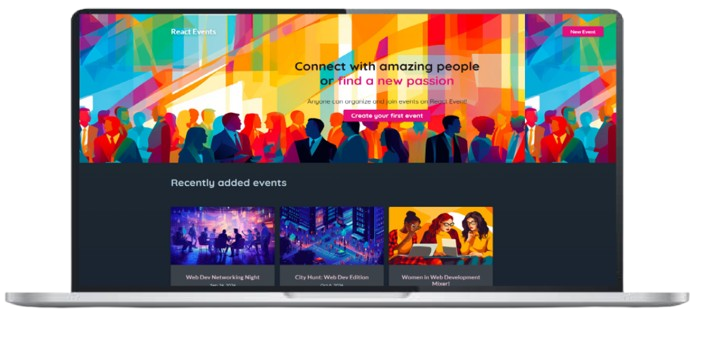

<h1 align="center">
  Events
</h1>

  

## ✨ Tecnologias

Esse projeto foi desenvolvido com as seguintes tecnologias:

- [React](https://react.dev)
- [Tanstack Query](https://tanstack.com)
- [CSS](https://www.w3schools.com/css/)
- [JavaScript](https://developer.mozilla.org/pt-BR/docs/Web/JavaScript)
- [Node.js - Previamente montado](https://nodejs.org/en)

## 💻 Projeto

O React Events é uma aplicação React que permite a listagem e edição de eventos. Utiliza Tanstack Query e outras otimizações para manuseamento das requisições HTTP.

## 🔖 Acesso

*Sem acesso*

## 🚀 Como executar

- Clone o repositório
- Instale as dependências do front-end e back-end com `npm install`
- Inicie o servidor front-end com `npm dev`
- Inicie o servidor front-end com `node app.js`
- 
Agora você pode acessar [`localhost:5173`](http://localhost:5173) do seu navegador.

---
